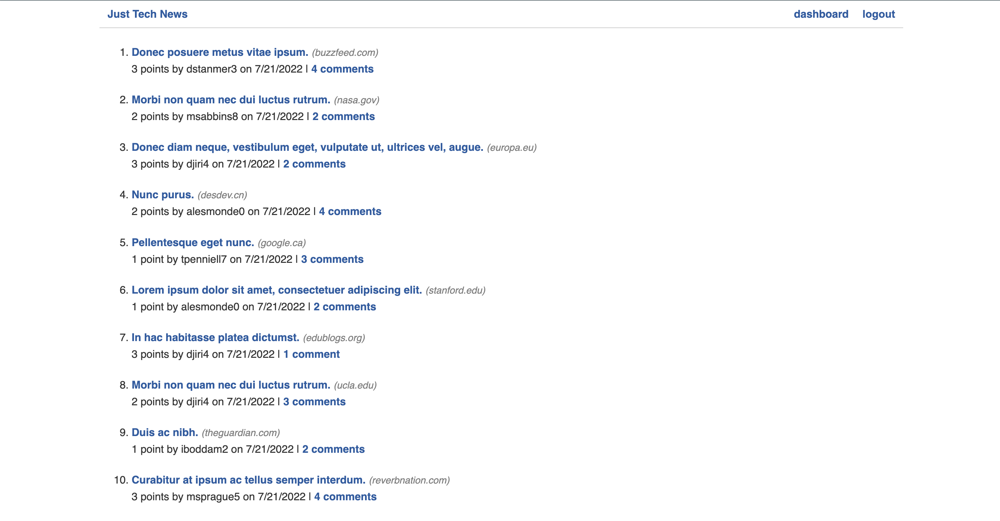

# MVC Tech Blog

### This has a functioning MySQL database which allows the user to create account, then post tech updates and store them in the database to come back to at a later date and for others to see.

# Stack

Express, MySQL2, Sequelize, Express Session, Connect Session Sequelize, Express Handlebars

### Demo the App - [https://tech-blog-mvc-mp.herokuapp.com/](https://tech-blog-mvc-mp.herokuapp.com/)

# Installation

### `npm i` to install required packages

# USAGE

### `npm run seeds` to seed the MySQL2 database

### `npm run start` to run the application
